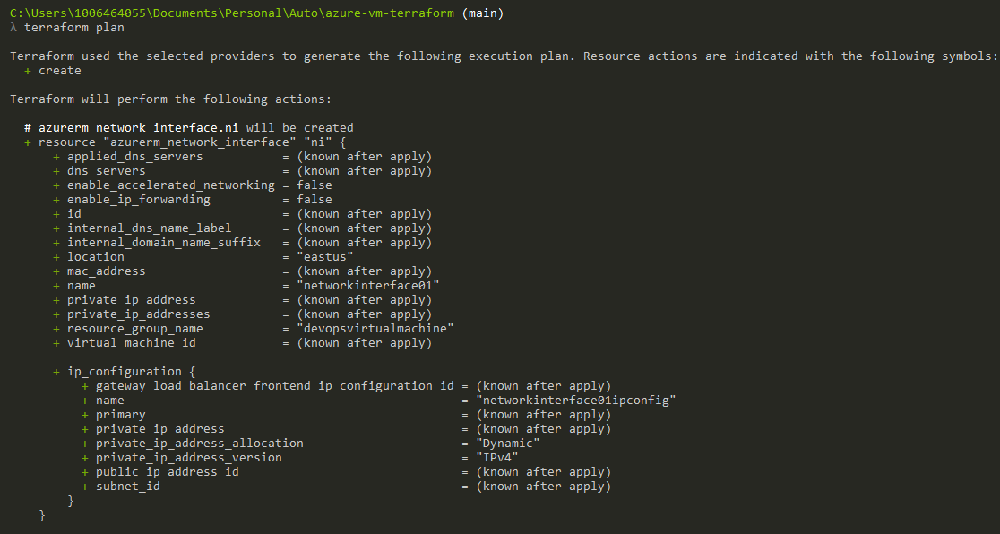
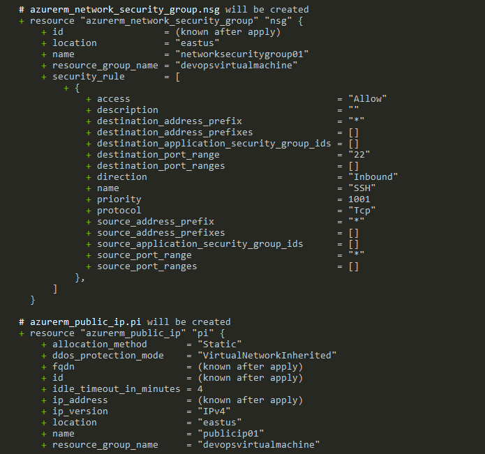

# Terraform Azure Infrastructure Deployment

Este repositorio contiene archivos de configuración de Terraform para implementar una infraestructura en Microsoft Azure. El objetivo principal de esta configuración es crear una máquina virtual (VM) en una red virtual junto con otros recursos necesarios.

## Requisitos

Antes de comenzar, asegúrate de tener lo siguiente:

- Una cuenta de Microsoft Azure.
- Terraform instalado en tu sistema.
- [Azure CLI](https://docs.microsoft.com/en-us/cli/azure/install-azure-cli) instalado y configurado con las credenciales adecuadas.

## Configuración

Antes de aplicar la configuración, debes configurar las variables necesarias en un archivo `terraform.tfvars`. Un ejemplo de las variables necesarias se proporciona en `variables.tf`.

## Implementación

Para implementar la infraestructura, ejecuta los siguientes comandos:

1. Inicializa Terraform:

   ```bash
   terraform init
   ```

   

2. Mira los cambios que se aplicarán antes de implementar:

   ```bash
   terraform plan
   ```

   
   
   
   
   
   

3. Aplica la configuración para crear la infraestructura en Azure:

   ```bash
   terraform apply
   ```

   
   
   
   
   
   
   

## Recursos Creados

Esta configuración de Terraform crea los siguientes recursos en Azure:

- Grupo de recursos
- Red virtual
- Subred
- Dirección IP pública
- Interfaz de red
- Máquina virtual
- Regla de seguridad de red (permite el tráfico SSH)

## Acceso SSH

Una clave SSH se genera automáticamente y se almacena en el archivo `./.ssh/my-azure-key`. Asegúrate de guardar esta clave de manera segura para acceder a tu máquina virtual.

## Limpieza

Para evitar cargos innecesarios en tu cuenta de Azure, puedes eliminar los recursos creados con Terraform ejecutando:

```bash
terraform destroy
```

¡Asegúrate de revisar y confirmar la eliminación de los recursos antes de continuar!
